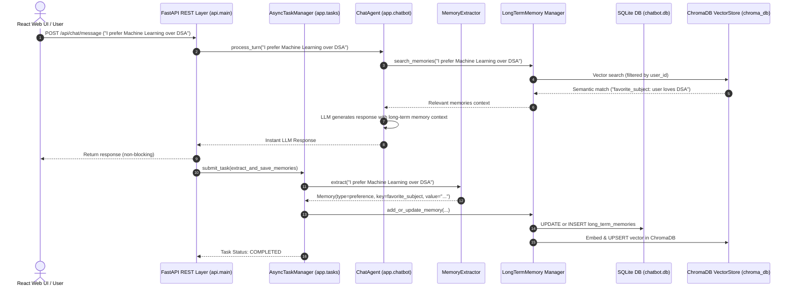

# AI Agent Dual-Store Long-Term Memory & Retrieval System

An industry-standard conversational AI agent featuring a **Dual-Store Long-Term Memory (LTM) & Semantic Retrieval Architecture**, **Async Background Task Processing Engine**, **FastAPI REST API Layer**, and an interactive **React + TypeScript Web UI Dashboard**. Built using **Python**, **FastAPI**, **SQLite** (for structured relational consistency and key-value preference tracking), **ChromaDB** (for vector similarity search), **React + Vite** (for modern dark-mode frontend management), and **OpenAI API** (for response generation and text embeddings).

---

## 🏗️ Architecture Overview

The system combines **Relational Consistency** (SQLite) and **Semantic Retrieval** (ChromaDB vector embeddings) with **Async Background LLM Memory Extraction**, **Non-Blocking Execution Queues**, and **Memory Reversal/Updates**.



---

## 📁 Repository Structure

```text
learn/
├── .env                       # Environment credentials & configuration (API keys, models)
├── .env .expamle              # Example template for environment variables
├── .gitignore                 # Git ignore rules for environment, venv, and DB files
├── requirement.txt            # Python dependencies (FastAPI, OpenAI, ChromaDB, Pydantic, etc.)
├── README.md                  # Comprehensive project documentation
├── walkthrough.md             # Development walkthrough & test execution reports
├── DESIGN.md                  # System design & architecture specification
│
├── api/                       # FastAPI REST API Backend Service Layer
│   ├── main.py                # FastAPI app initialization, CORS middleware, & route mounting
│   ├── dependencies.py        # Dependency injection container (ChatAgent, ChatStore, LTM, TaskManager)
│   ├── schemas.py             # Pydantic request/response payload schemas
│   └── routes/                # API endpoint controller routers
│       ├── chat.py            # Chat interaction turns & streaming endpoints
│       ├── conversations.py   # Conversation session CRUD & deletion routes
│       ├── memory.py          # LTM memory viewing, creation, & deletion endpoints
│       ├── observability.py   # Metrics and application logs retrieval
│       ├── tasks.py           # Background async task status & progress monitoring
│       └── users.py           # User profile creation, listing, & deletion endpoints
│
├── app/                       # Core Python application logic
│   ├── main.py                # CLI entry point for interactive terminal chat sessions
│   ├── config.py              # Application configuration & env settings loader
│   ├── chatbot/
│   │   └── agent.py           # ChatAgent orchestrator (retrieval, prompt assembly, memory pipeline)
│   ├── tasks/
│   │   ├── __init__.py        # Task manager exports
│   │   └── manager.py         # AsyncTaskManager worker thread pool & non-blocking task queue
│   ├── memory/
│   │   ├── database.py        # SQLite schema initialization & connection factory
│   │   ├── chat_store.py      # SQLite CRUD store (users, conversations, messages, memories)
│   │   ├── short_term.py      # Active session turn-level message buffer
│   │   ├── sumarizer.py       # Conversation history rolling summarizer
│   │   ├── context_manager.py # Dynamic prompt builder combining summary, LTM, & turn history
│   │   ├── extractor.py       # LLM structured memory extraction engine
│   │   └── long_term.py       # Dual-store manager (SQLite + ChromaDB in-place memory updates)
│   ├── caching/
│   │   ├── cache_store.py     # In-Memory TTLCache store with capacity eviction
│   │   ├── embedding_cache.py # CachedEmbeddingModel wrapper for SHA-256 vector caching
│   │   └── memory_cache.py    # Memory query cache with automated invalidation
│   ├── embeddings/
│   │   ├── base.py            # Abstract base class for embedding models
│   │   └── openai_embedding.py# OpenAI text embedding implementation (text-embedding-3-small)
│   ├── models/
│   │   ├── base.py            # Abstract base class for LLM interfaces
│   │   ├── openai_model.py    # OpenAI chat completion model implementation
│   │   └── factory.py         # Factory pattern for instantiating LLM model instances
│   ├── observability/
│   │   ├── logger.py          # Structured JSON/Console logger with trace IDs
│   │   └── metrics.py         # Operational metrics collector (latency, hit rate, errors)
│   ├── utils/
│   │   └── retry.py           # Exponential backoff retry utility decorator
│   └── vector_store/
│       ├── base.py            # Abstract interface for vector stores
│       └── chroma_store.py    # ChromaDB persistent vector store implementation
│
├── frontend/                  # React + TypeScript + Vite Web Dashboard
│   ├── package.json           # Frontend package dependencies (React, Lucide, Tailwind)
│   ├── vite.config.ts         # Vite build configuration & API proxy setup
│   ├── index.html             # Single-page app HTML entry point
│   └── src/
│       ├── main.tsx           # React app bootstrap renderer
│       ├── App.tsx            # Main layout container & state coordinator
│       ├── index.css          # Styling & glassmorphism theme system
│       ├── services/
│       │   └── api.ts         # Axios REST API client & error handling
│       └── components/
│           ├── Header.tsx     # Context token budget stats bar & user switcher
│           ├── Sidebar.tsx    # Session history, user profiles, & session creation/deletion
│           ├── ChatView.tsx   # Real-time chat workspace, turn history, & prompt suggestions
│           ├── MemoryInspector.tsx # Interactive LTM drawer (CRUD operations on user memories)
│           └── ObservabilityPanel.tsx # Live metrics, cache stats, background tasks, & logs
│
└── tests/                     # Comprehensive Unit & Integration Test Suite
    ├── test_api_endpoints.py  # Integration tests for FastAPI REST endpoints
    ├── test_async_tasks.py    # Unit tests for AsyncTaskManager & background task execution
    ├── test_caching.py        # Unit tests for TTLCache, embedding caching, & memory query caching
    ├── test_context_manager.py# Unit tests for Context Engineering, token budgeting, & pruning
    ├── test_long_term_memory.py# Unit tests for LTM, dual storage, updates, deletion, & retrieval
    └── test_observability.py  # Unit tests for structured logging, metrics, retries, & fallbacks
```

---

## 📄 File Formats & Detailed File Breakdown

### 🛠️ Root Configuration & Core Entry Points

#### [`config.py`](file:///c:/Users/dell/Documents/AI_agents/learn/app/config.py)
- **Purpose**: Loads configuration variables from `.env`.
- **Key Parameters**:
  - `OPENAI_API_KEY`: API key for OpenAI model and embedding calls.
  - `MODEL_NAME`: Default LLM model (`gpt-4o-mini`).
  - `EMBEDDING_MODEL`: OpenAI text embedding model (`text-embedding-3-small`).
  - `CHROMA_PATH`: Local directory path for ChromaDB storage (`./chroma_db`).
  - `TEMPERATURE`: Sampling temperature for response generation (`0.7`).

#### [`main.py`](file:///c:/Users/dell/Documents/AI_agents/learn/app/main.py)
- **Purpose**: Interactive CLI entry point for terminal interaction.
- **Workflow**:
  1. Initializes configuration, database schema, vector store, and embedding engine.
  2. Prompts user for User ID (creates a new user record in SQLite if left empty).
  3. Displays active conversations or creates a new chat session.
  4. Launches interactive command loop with `ChatAgent`.

#### [`requirement.txt`](file:///c:/Users/dell/Documents/AI_agents/learn/requirement.txt)
- **Purpose**: Specifies Python package dependencies (`fastapi`, `uvicorn`, `openai`, `chromadb`, `python-dotenv`, `pydantic`, `langchain`, etc.).

---

### 🌐 FastAPI REST API Layer (`api/`)

#### [`api/main.py`](file:///c:/Users/dell/Documents/AI_agents/learn/api/main.py)
- **Purpose**: Web server entry point powering the REST backend.
- **Functionality**: Configures CORS middleware for frontend communication, initializes global dependencies, and registers sub-routers.

#### [`api/dependencies.py`](file:///c:/Users/dell/Documents/AI_agents/learn/api/dependencies.py)
- **Purpose**: Dependency injection module providing singleton instances of `ChatStore`, `LongTermMemory`, `ChatAgent`, and `AsyncTaskManager`.

#### [`api/schemas.py`](file:///c:/Users/dell/Documents/AI_agents/learn/api/schemas.py)
- **Purpose**: Data transfer validation schemas (Pydantic) for requests/responses (`UserResponse`, `ConversationResponse`, `MessageRequest`, `MessageResponse`, `MemoryRequest`, `MemoryResponse`, `TaskResponse`).

#### [`api/routes/`](file:///c:/Users/dell/Documents/AI_agents/learn/api/routes/)
- **`chat.py`**: POST endpoint `/api/chat/message` to send user inputs, execute dual-store retrieval, trigger LLM generation, and enqueue async background memory extraction.
- **`conversations.py`**: Session management endpoints (`GET`, `POST`, `DELETE /api/conversations/{id}`).
- **`memory.py`**: Memory CRUD routes (`GET /api/memory/{user_id}`, `POST /api/memory/{user_id}`, `DELETE /api/memory/{memory_id}`).
- **`users.py`**: User CRUD endpoints (`GET /api/users`, `POST /api/users`, `DELETE /api/users/{user_id}`).
- **`tasks.py`**: Task monitoring endpoints (`GET /api/tasks/{task_id}`, `GET /api/tasks/user/{user_id}`).
- **`observability.py`**: System health metrics (`GET /api/observability/metrics`) and log stream endpoints.

---

### ⚡ Async Background Task Engine (`app/tasks/`)

#### [`app/tasks/manager.py`](file:///c:/Users/dell/Documents/AI_agents/learn/app/tasks/manager.py)
- **Class**: `AsyncTaskManager`
- **Purpose**: Manages asynchronous, non-blocking background operations (memory extraction, summarization, vector indexing).
- **Features**:
  - **Thread Pool Execution**: Uses `ThreadPoolExecutor` to handle background LLM calls without delaying chat turn responses.
  - **Task Lifecycles**: Tracks states (`PENDING`, `RUNNING`, `COMPLETED`, `FAILED`) with UUID task tracking.
  - **Non-Blocking Chat Turn**: Immediate LLM response generation while heavy memory extraction runs asynchronously in the background.

---

### 💻 Modern Web UI Dashboard (`frontend/`)

#### [`frontend/src/App.tsx`](file:///c:/Users/dell/Documents/AI_agents/learn/frontend/src/App.tsx)
- **Purpose**: Main UI container managing active user state, session selection, sidebar drawer, and modal view states.

#### Components (`frontend/src/components/`)
- **[`Sidebar.tsx`](file:///c:/Users/dell/Documents/AI_agents/learn/frontend/src/components/Sidebar.tsx)**: User selector, session creation, chat session list, and session/user deletion triggers.
- **[`ChatView.tsx`](file:///c:/Users/dell/Documents/AI_agents/learn/frontend/src/components/ChatView.tsx)**: Thread display, markdown rendering, turn response streaming, memory tag indicators, and quick prompt suggestions.
- **[`MemoryInspector.tsx`](file:///c:/Users/dell/Documents/AI_agents/learn/frontend/src/components/MemoryInspector.tsx)**: Interactive slide-over modal for live LTM CRUD operations (filtering preferences, goals, facts, plans, decisions).
- **[`ObservabilityPanel.tsx`](file:///c:/Users/dell/Documents/AI_agents/learn/frontend/src/components/ObservabilityPanel.tsx)**: Visual dashboard featuring cache hit rates, vector search latency distribution, background task status monitor, and structured log viewer.
- **[`Header.tsx`](file:///c:/Users/dell/Documents/AI_agents/learn/frontend/src/components/Header.tsx)**: Dynamic token budget meter, user badge, and navigation triggers.

---

### 🤖 Chatbot Agent & Memory Modules (`app/chatbot/` & `app/memory/`)

#### [`agent.py`](file:///c:/Users/dell/Documents/AI_agents/learn/app/chatbot/agent.py)
- **Class**: `ChatAgent`
- **Purpose**: Primary conversational orchestrator managing context loading, memory retrieval, prompt construction, LLM completion, and memory persistence.

#### [`database.py`](file:///c:/Users/dell/Documents/AI_agents/learn/app/memory/database.py) & [`chat_store.py`](file:///c:/Users/dell/Documents/AI_agents/learn/app/memory/chat_store.py)
- **Classes**: `Database`, `ChatStore`
- **Purpose**: SQLite schema definition and relational CRUD store (`users`, `conversations`, `messages`, `long_term_memories`).

#### [`extractor.py`](file:///c:/Users/dell/Documents/AI_agents/learn/app/memory/extractor.py)
- **Classes**: `MemoryType` (Enum), `Memory` (Pydantic model), `MemoryExtractor`
- **Supported Memory Types**: `preference`, `goal`, `fact`, `plan`, `decision`. Supports extraction of both new memories and explicit forget/deletion directives.

#### [`long_term.py`](file:///c:/Users/dell/Documents/AI_agents/learn/app/memory/long_term.py)
- **Class**: `LongTermMemory`
- **Purpose**: Dual-store manager synchronizing SQLite and ChromaDB vector store.
- **Features**:
  - **Memory Reversal / In-Place Updates**: Replaces old entries when user preferences change (e.g. from "likes Python" to "prefers Rust") avoiding duplicate contradictory facts.
  - **Atomic Deletions**: Deletes memory entries by ID, key/type/scope, or bulk user wipe across SQLite and ChromaDB.
  - **Hybrid Retrieval (Vector + Keyword Search with RRF)**: Merges dense vector semantic search with SQLite metadata & keyword search using Reciprocal Rank Fusion (RRF).

---

### 🧪 Unit & Integration Test Suite (`tests/`)

- **`test_api_endpoints.py`**: End-to-end integration test suite verifying user endpoints, session endpoints, chat messaging, memory management, and deletion cascades.
- **`test_async_tasks.py`**: Unit tests for task creation, worker thread pool execution, background memory processing, and status lifecycle polling.
- **`test_long_term_memory.py`**: Tests for dual-store insertion, vector retrieval, memory reversal updates, RRF hybrid search, and atomic memory deletion.
- **`test_caching.py`**: Unit tests for TTLCache, vector embedding caching, and memory query cache invalidation.
- **`test_context_manager.py`**: Unit tests for prompt context assembly, token budgeting, dynamic turn pruning, and memory formatting.
- **`test_observability.py`**: Unit tests for structured JSON logging, metrics metrics collection, exponential backoff retries, and fallback mechanisms.

---

## 🚀 Quick Start Guide

### 1. Requirements & Environment Setup
Ensure Python 3.10+ and Node.js 18+ are installed. Clone the repository and copy `.env`:

```bash
cp ".env .expamle" .env
```

Configure your OpenAI credentials in `.env`:
```env
PROVIDER=openai
OPENAI_API_KEY=your_openai_api_key_here
MODEL_NAME=gpt-4o-mini
EMBEDDING_MODEL=text-embedding-3-small
CHROMA_PATH=./chroma_db
TEMPERATURE=0.7
```

---

### 2. Install Dependencies

#### Python Backend Dependencies:
```bash
pip install -r requirement.txt
```

#### Frontend Web Dependencies:
```bash
cd frontend
npm install
cd ..
```

---

### 3. Run Automated Unit & Integration Tests
Run the entire test suite across all modules:

```bash
python -m unittest discover tests
```

Or run individual test modules:
```bash
python tests/test_api_endpoints.py
python tests/test_async_tasks.py
python tests/test_long_term_memory.py
```

---

### 4. Running the Application

#### Option A: Full-Stack Web App (FastAPI REST Backend + React Dashboard)

1. **Start the FastAPI Backend Server**:
   ```bash
   python -m uvicorn api.main:app --host 127.0.0.1 --port 8000 --reload
   ```

2. **Start the React Frontend Dev Server**:
   ```bash
   cd frontend
   npm run dev
   ```
   Open your browser at `http://localhost:5173`.

#### Option B: Terminal Interactive CLI Mode
```bash
python app/main.py
```

---

## 📌 Summary of Features Implemented

- ✅ **FastAPI REST Service Layer**: Production API exposing clean REST endpoints for chat interaction, conversation management, user memory CRUD, async task tracking, and live observability metrics.
- ✅ **Async Background Task Worker Pipeline**: Non-blocking memory extraction and background indexing via `AsyncTaskManager`, keeping chat turn response latency ultra-low.
- ✅ **Full-Featured React + TypeScript Web Dashboard**: Modern dark-themed glassmorphism interface featuring session sidebars, visual memory inspector drawers, live background task tracking, and observability analytics.
- ✅ **Multi-Level Caching Architecture**: In-memory `TTLCache`, SHA-256 `CachedEmbeddingModel` for 0ms vector embedding lookups, and user-level `MemoryQueryCache` with automated cache invalidation upon memory mutation.
- ✅ **Observability & Reliability Framework**: Structured JSON/Console logging with Trace IDs, operational metrics tracking (LLM latency, embedding calls, memory hit rate), exponential backoff retries (`retry_with_backoff`), and safe vector degradation.
- ✅ **Dual-Store Synchronization**: Relational integrity via SQLite + high-performance semantic vector retrieval via ChromaDB.
- ✅ **Context Engineering Engine**: Dynamic prompt assembly, token budgeting, memory categorization (*Preferences*, *Goals*, *Facts*, *Plans*, *Decisions*), dynamic turn pruning, and context stats analytics.
- ✅ **Long-Term Memory Deletion & Automated Extraction**: Purges memory entries by ID, key/type/scope, or bulk user wipe across SQLite and ChromaDB, with automatic deletion detection ("Forget my location").
- ✅ **Hybrid Retrieval (Vector + Keyword RRF)**: Merges dense vector semantic search with SQLite metadata & keyword search using Reciprocal Rank Fusion (RRF).
- ✅ **Memory Reversal / In-Place Updates**: Prevents duplicate or contradictory preference entries when user facts change over time.