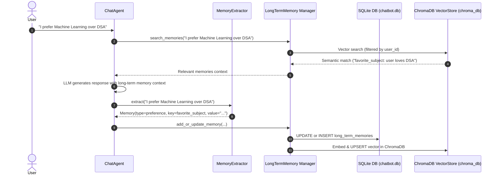

# AI Agent Dual-Store Long-Term Memory & Retrieval System

An industry-standard conversational AI agent featuring a **Dual-Store Long-Term Memory (LTM) & Semantic Retrieval Architecture**. Built using **Python**, **SQLite** (for structured relational consistency and key-value preference tracking), **ChromaDB** (for vector similarity search), and **OpenAI API** (for response generation and text embeddings).

---

## 🏗️ Architecture Overview

The system combines **Relational Consistency** (SQLite) and **Semantic Retrieval** (ChromaDB vector embeddings) with **Automated LLM Memory Extraction** and **Memory Reversal/Updates**.



---

## 📁 Repository Structure

```text
learn/
├── .env                       # Environment credentials & configuration (API keys, models)
├── .env .expamle              # Example template for environment variables
├── .gitignore                 # Git ignore rules for environment, venv, and DB files
├── requirement.txt            # Python dependencies (OpenAI, ChromaDB, Pydantic, etc.)
├── README.md                  # Comprehensive project documentation
├── walkthrough.md             # Development walkthrough & test execution reports
├── app/                       # Core application codebase
│   ├── main.py                # CLI entry point for interactive chat sessions
│   ├── config.py              # Application configuration & env settings loader
│   ├── chatbot/
│   │   └── agent.py           # ChatAgent orchestrator (retrieval, generation, memory pipeline)
│   ├── embeddings/
│   │   ├── base.py            # Abstract base class for embedding models
│   │   └── openai_embedding.py# OpenAI text embedding implementation
│   ├── memory/
│   │   ├── database.py        # SQLite schema initialization & connection factory
│   │   ├── chat_store.py      # SQLite CRUD store (users, conversations, messages, memories)
│   │   ├── short_term.py      # Active session turn-level buffer management
│   │   ├── sumarizer.py       # Conversation history summarization on context overflow
│   │   ├── context_manager.py # Prompt builder combining summary, LTM, & recent messages
│   │   ├── extractor.py       # LLM memory extraction engine (Pydantic / JSON schema)
│   │   └── long_term.py       # Dual-store sync manager (SQLite + ChromaDB memory reversal)
│   ├── models/
│   │   ├── base.py            # Abstract base class for LLM interfaces
│   │   ├── openai_model.py    # OpenAI chat completion model implementation
│   │   └── factory.py         # Factory pattern for instantiating LLM model instances
│   ├── storage/               # Placeholder directory for file storage modules
│   └── vector_store/
│       ├── base.py            # Abstract interface for vector stores
│       └── chroma_store.py    # ChromaDB persistent vector store implementation
└── tests/
    └── test_long_term_memory.py # Unit tests for LTM, vector store, and extraction
```

---

## 📄 File Formats & Detailed File Breakdown

### 🛠️ Root Configuration & Project Files

#### [`config.py`](file:///c:/Users/dell/Documents/AI_agents/learn/app/config.py)
- **Purpose**: Loads configuration variables from `.env`.
- **Key Parameters**:
  - `OPENAI_API_KEY`: API key for OpenAI model and embedding calls.
  - `MODEL_NAME`: Default LLM model (`gpt-4o-mini`).
  - `EMBEDDING_MODEL`: OpenAI text embedding model (`text-embedding-3-small`).
  - `CHROMA_PATH`: Local directory path for ChromaDB storage (`./chroma_db`).
  - `TEMPERATURE`: Sampling temperature for response generation (`0.7`).

#### [`main.py`](file:///c:/Users/dell/Documents/AI_agents/learn/app/main.py)
- **Purpose**: Interactive CLI entry point.
- **Workflow**:
  1. Initializes configuration, database schema, vector store, and embedding engine.
  2. Prompts user for User ID (creates a new user record in SQLite if left empty).
  3. Displays active conversations or creates a new chat session.
  4. Launches interactive command loop with `ChatAgent`.

#### [`requirement.txt`](file:///c:/Users/dell/Documents/AI_agents/learn/requirement.txt)
- **Purpose**: Specifies Python package dependencies:
  - `openai`: Client for LLM and Embedding endpoints.
  - `chromadb`: Vector database for semantic document search.
  - `python-dotenv`: Environment variable management.
  - `pydantic`: Structured memory data validation and parsing.
  - `langchain` / `langgraph`: LLM framework dependencies.

---

### 🤖 Chatbot Agent Module (`app/chatbot/`)

#### [`agent.py`](file:///c:/Users/dell/Documents/AI_agents/learn/app/chatbot/agent.py)
- **Class**: `ChatAgent`
- **Purpose**: Primary conversational orchestrator managing full interaction turns:
  - **Context Loading**: Loads recent chat history and existing summary from SQLite (`load_context`).
  - **Memory Retrieval**: Queries `LongTermMemory` using semantic vector search for relevant background facts/preferences.
  - **Prompt Construction**: Uses `ContextManager` to compose system context (Summary + LTM Context + Short-term messages).
  - **Response Generation**: Solicits LLM generation via `BaseLLM`.
  - **Memory Extraction & Reversal**: Calls `MemoryExtractor` post-response to update dual storage (`SQLite` + `ChromaDB`) without blocking.
  - **Session Summarization**: Automatically condenses conversation history when message limit threshold (10 messages) is reached.

---

### 🧠 Memory Management Modules (`app/memory/`)

#### [`database.py`](file:///c:/Users/dell/Documents/AI_agents/learn/app/memory/database.py)
- **Class**: `Database`
- **Purpose**: Manages SQLite connection and schema creation (`chatbot.db`).
- **SQL Schema Definitions**:
  - `users` Table:
    - `id` (INTEGER PRIMARY KEY AUTOINCREMENT)
    - `created_at` (TIMESTAMP DEFAULT CURRENT_TIMESTAMP)
  - `conversations` Table:
    - `id` (INTEGER PRIMARY KEY AUTOINCREMENT)
    - `user_id` (FOREIGN KEY -> `users.id` ON DELETE CASCADE)
    - `title` (TEXT), `summary` (TEXT), `created_at`, `updated_at`
  - `messages` Table:
    - `id` (INTEGER PRIMARY KEY AUTOINCREMENT)
    - `conversation_id` (FOREIGN KEY -> `conversations.id` ON DELETE CASCADE)
    - `role` (TEXT: 'user' | 'assistant'), `content` (TEXT), `created_at`
  - `long_term_memories` Table:
    - `id` (INTEGER PRIMARY KEY AUTOINCREMENT)
    - `user_id` (FOREIGN KEY -> `users.id` ON DELETE CASCADE)
    - `memory_type` (TEXT: 'preference' | 'goal' | 'fact' | 'plan' | 'decision')
    - `key` (TEXT), `value` (TEXT), `scope` (TEXT), `created_at`, `updated_at`

#### [`chat_store.py`](file:///c:/Users/dell/Documents/AI_agents/learn/app/memory/chat_store.py)
- **Class**: `ChatStore`
- **Purpose**: Relational database operations layer for users, conversations, messages, and long-term memory CRUD in SQLite.
- **Key Methods**:
  - `create_user()`, `get_user()`
  - `create_conversation()`, `get_user_conversations()`, `update_summary()`, `get_summary()`
  - `save_message()`, `get_recent_messages()`
  - `save_memory()`, `find_memory()`, `update_memory()`, `get_memories()`, `delete_memory()`

#### [`short_term.py`](file:///c:/Users/dell/Documents/AI_agents/learn/app/memory/short_term.py)
- **Class**: `ShortTermMemory`
- **Purpose**: Manages volatile in-memory chat session history buffer for the current turn.

#### [`sumarizer.py`](file:///c:/Users/dell/Documents/AI_agents/learn/app/memory/sumarizer.py)
- **Class**: `Summarizer`
- **Purpose**: Uses LLM prompt to summarize older messages into a rolling single summary string when short-term message count exceeds 10 turns.

#### [`context_manager.py`](file:///c:/Users/dell/Documents/AI_agents/learn/app/memory/context_manager.py)
- **Class**: `ContextManager`
- **Purpose**: Assembles full context message structure for LLM API calls.
- **Prompt Structure Format**:
  ```json
  [
    {
      "role": "system",
      "content": "Conversation summary:\n<summary>\n\nRelevant User Long-Term Memory & Preferences:\n- PREFERENCE [favorite_subject]: user prefers Machine Learning over DSA"
    },
    { "role": "user", "content": "Recent turn message..." },
    { "role": "user", "content": "Current user prompt" }
  ]
  ```

#### [`extractor.py`](file:///c:/Users/dell/Documents/AI_agents/learn/app/memory/extractor.py)
- **Classes**: `MemoryType` (Enum), `Memory` (Pydantic model), `MemoryExtractor`
- **Purpose**: Analyzes user messages using LLM structured extraction to identify long-term memory facts.
- **Extracted Memory Schema (JSON)**:
  ```json
  {
    "memories": [
      {
        "memory_type": "preference",
        "key": "favorite_subject",
        "value": "user prefers Machine Learning over DSA",
        "scope": null
      }
    ]
  }
  ```
- **Supported Memory Types**:
  - `preference`: Likes, dislikes, favorite topics/languages.
  - `goal`: Short/long term ambitions (e.g. cracking SDE interviews).
  - `fact`: User attributes (e.g. student status, location).
  - `plan`: Scheduled or intended upcoming actions.
  - `decision`: Explicit decisions made by the user.

#### [`long_term.py`](file:///c:/Users/dell/Documents/AI_agents/learn/app/memory/long_term.py)
- **Class**: `LongTermMemory`
- **Purpose**: Orchestrates dual storage synchronization across SQLite database and ChromaDB vector store.
- **Memory Reversal / In-Place Update Logic**:
  - When saving a memory, `find_memory` checks if a record for `(user_id, memory_type, key, scope)` exists in SQLite.
  - **If found**: Updates SQLite row value AND performs ChromaDB `.upsert()` using existing memory ID, preventing duplicate conflicting preference entries.
  - **If not found**: Inserts new record into SQLite AND calls ChromaDB `.add()`.
- **Atomic Memory Deletion**:
  - Supports `delete_memory(id)`, `delete_memory_by_key(type, key, scope)`, and `delete_all_memories()`, synchronizing deletions across SQLite and ChromaDB vector collection.
- **Hybrid Retrieval (Vector + Keyword Search with RRF)**:
  - Merges dense vector embeddings from ChromaDB and metadata/keyword search ranks from SQLite using Reciprocal Rank Fusion (RRF).

---

### 🧬 Embeddings & Vector Store Modules (`app/embeddings/` & `app/vector_store/`)

#### [`embeddings/base.py`](file:///c:/Users/dell/Documents/AI_agents/learn/app/embeddings/base.py) & [`openai_embedding.py`](file:///c:/Users/dell/Documents/AI_agents/learn/app/embeddings/openai_embedding.py)
- **Classes**: `EmbeddingModel` (Abstract Base), `OpenAIEmbedding`
- **Purpose**: Interface and implementation for generating dense vector embeddings via OpenAI API (`text-embedding-3-small`, 1536 dimensions).

#### [`vector_store/base.py`](file:///c:/Users/dell/Documents/AI_agents/learn/app/vector_store/base.py) & [`chroma_store.py`](file:///c:/Users/dell/Documents/AI_agents/learn/app/vector_store/chroma_store.py)
- **Classes**: `VectorStore` (Abstract Base), `ChromaVectorStore`
- **Purpose**: Wraps ChromaDB `PersistentClient` for storing and retrieving high-dimensional embeddings.
- **ChromaDB Document Metadata Format**:
  ```json
  {
    "id": "1",
    "document": "PREFERENCE [favorite_subject]: user prefers Machine Learning over DSA",
    "metadata": {
      "user_id": 1,
      "memory_type": "preference",
      "key": "favorite_subject",
      "scope": ""
    }
  }
  ```

---

### 🤖 LLM Models Abstraction (`app/models/`)

#### [`models/base.py`](file:///c:/Users/dell/Documents/AI_agents/learn/app/models/base.py), [`openai_model.py`](file:///c:/Users/dell/Documents/AI_agents/learn/app/models/openai_model.py), [`factory.py`](file:///c:/Users/dell/Documents/AI_agents/learn/app/models/factory.py)
- **Classes**: `LLM` (Abstract Base), `OpenAIModel`, `ModelFactory`
- **Purpose**: Provides decoupled interface and factory for model instantiation, supporting provider switching (`openai`, etc.).

---

### 🧪 Unit Test Suite (`tests/`)

#### [`test_long_term_memory.py`](file:///c:/Users/dell/Documents/AI_agents/learn/tests/test_long_term_memory.py)
- **Class**: `TestLongTermMemory`
- **Purpose**: Standardized unit test suite for dual-store long-term memory operations:
  - `test_add_and_retrieve_memory`: Validates SQLite storage & vector similarity search.
  - `test_memory_reversal_and_update`: Validates memory reversal and in-place update consistency across both stores.
  - `test_memory_extractor_parsing`: Validates LLM JSON output cleaning and Pydantic model parsing.
  - `test_delete_memory_by_id`: Validates single memory deletion across both stores.
  - `test_delete_memory_by_key`: Validates deletion by metadata key across both stores.
  - `test_delete_all_memories`: Validates clearing all user memories across both stores.
  - `test_hybrid_retrieval_and_rrf`: Validates hybrid vector & keyword retrieval using Reciprocal Rank Fusion.
  - `test_memory_extractor_deletion_parsing`: Validates LLM extraction of delete instructions.

---

## 🚀 Quick Start Guide

### 1. Requirements & Environment Setup
Ensure Python 3.10+ is installed. Clone the repository and configure `.env`:

```bash
cp ".env .expamle" .env
```

Add your OpenAI API key in `.env`:
```env
PROVIDER=openai
OPENAI_API_KEY=your_openai_api_key_here
MODEL_NAME=gpt-4o-mini
EMBEDDING_MODEL=text-embedding-3-small
CHROMA_PATH=./chroma_db
TEMPERATURE=0.7
```

### 2. Install Dependencies
```bash
pip install -r requirement.txt
```

### 3. Run Automated Unit Tests
```bash
python tests/test_long_term_memory.py
```

### 4. Launch Interactive Chat Session
```bash
python app/main.py
```

---

## 📌 Summary of Features Implemented
- ✅ **Dual-Store Synchronization**: Relational integrity via SQLite + High performance semantic retrieval via ChromaDB.
- ✅ **Long-Term Memory Deletion**: Purges memory entries by ID, key/type/scope, or bulk user wipe across SQLite and ChromaDB.
- ✅ **Automated Deletion Extraction**: `MemoryExtractor` detects forget/delete requests ("Forget my location") and executes deletions.
- ✅ **Hybrid Retrieval (Vector + Keyword RRF)**: Merges dense vector semantic search with SQLite metadata & keyword search using Reciprocal Rank Fusion (RRF).
- ✅ **Memory Reversal / In-Place Updates**: Prevents duplicate or contradictory preference entries when user facts change over time.
- ✅ **Metadata Scoped Vector Queries**: Vector search is strictly scoped to the active `user_id`.
- ✅ **Rolling Summarization**: Maintains efficient context lengths by summarizing overflow turns in short-term chat memory.