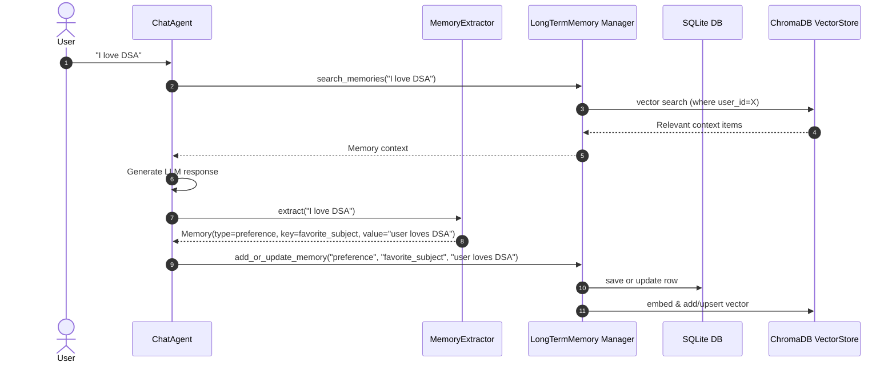

# Walkthrough - Long-Term Retrieval and Memory System

We have successfully implemented an **Industry Standard Dual-Store Long-Term Memory (LTM) & Retrieval System** combining **SQLite** (for structured data consistency, relational querying, and key-value preference tracking) and **ChromaDB** (for semantic vector search).

## Architecture Overview



## Key Changes Implemented

### Config & Infrastructure
- Updated [`config.py`](file:///c:/Users/dell/Documents/AI_agents/learn/app/config.py) to support `embedding_model` (`text-embedding-3-small`) and `chroma_path` (`./chroma_db`).

### Vector Storage & Embeddings
- Implemented [`ChromaVectorStore`](file:///c:/Users/dell/Documents/AI_agents/learn/app/vector_store/chroma_store.py) extending [`VectorStore`](file:///c:/Users/dell/Documents/AI_agents/learn/app/vector_store/base.py) with methods: `add`, `update` (upsert), `search` (with `user_id` metadata filtering), and `delete`.
- Verified [`OpenAIEmbedding`](file:///c:/Users/dell/Documents/AI_agents/learn/app/embeddings/openai_embedding.py) for OpenAI embedding generation.

### Database & Relational Storage
- Updated [`ChatStore`](file:///c:/Users/dell/Documents/AI_agents/learn/app/memory/chat_store.py) to provide `save_memory`, `update_memory`, `find_memory`, `get_memories`, and `delete_memory`.

### Extraction & Dual Store Management
- Created [`MemoryExtractor`](file:///c:/Users/dell/Documents/AI_agents/learn/app/memory/extractor.py) for LLM-based structured extraction of user preferences, goals, facts, plans, and decisions.
- Created [`LongTermMemory`](file:///c:/Users/dell/Documents/AI_agents/learn/app/memory/long_term.py) to orchestrate dual-store operations:
  - **Memory Reversal / Updates**: Automatically updates existing entries in SQLite and ChromaDB when user updates a preference (e.g., from "loves DSA" to "prefers Machine Learning over DSA") without creating duplicate conflicting memories.
  - **Semantic Retrieval**: Performs vector search using `ChromaVectorStore` filtered by `user_id`.

### Context & Agent Integration
- Enhanced [`ContextManager`](file:///c:/Users/dell/Documents/AI_agents/learn/app/memory/context_manager.py) to format long-term memories into system prompts.
- Updated [`ChatAgent`](file:///c:/Users/dell/Documents/AI_agents/learn/app/chatbot/agent.py) and [`main.py`](file:///c:/Users/dell/Documents/AI_agents/learn/app/main.py) to orchestrate retrieval, context injection, and post-turn memory extraction & persistence.

---

## Verification Results

### Automated Tests
Ran full test suite in [`tests/test_long_term_memory.py`](file:///c:/Users/dell/Documents/AI_agents/learn/tests/test_long_term_memory.py):

```bash
python tests/test_long_term_memory.py
```

**Results**:
- `test_add_and_retrieve_memory`: Passed (verified SQLite insertion & ChromaDB vector search).
- `test_memory_reversal_and_update`: Passed (verified in-place preference reversal in both stores).
- `test_memory_extractor_parsing`: Passed (verified JSON parsing & Memory model conversion).

```text
----------------------------------------------------------------------
Ran 3 tests in 2.123s

OK
```

---

## Delete User & Conversation Feature Verification

### Root Cause Analysis
1. **Outdated Server Process**: An old instance of `uvicorn` (PID 27076) had been running since September 3rd without `--reload`. Newer API routes (`DELETE /api/users/{user_id}` and `DELETE /api/conversations/{conversation_id}`) were not recognized by this process, returning `404 Not Found` or `405 Method Not Allowed`.
2. **UI State & Visibility**:
   - Delete button for sessions in [`Sidebar.tsx`](file:///c:/Users/dell/Documents/AI_agents/learn/frontend/src/components/Sidebar.tsx) was styled with `opacity-0 group-hover:opacity-100`, making it invisible on the active session.
   - Active user delete in [`Sidebar.tsx`](file:///c:/Users/dell/Documents/AI_agents/learn/frontend/src/components/Sidebar.tsx) dropdown did not close the dropdown after action.
   - Deletion errors were only logged to console without user-facing feedback.
   - Stale conversation and message states were not immediately cleared during user deletion.

### Fixes & Enhancements
1. **Server Restart with Auto-Reload**: Terminated stale uvicorn instance and restarted with `python -m uvicorn api.main:app --host 127.0.0.1 --port 8000 --reload` so all current and future endpoints stay synchronized.
2. **Frontend UI Enhancements**:
   - Added persistent visibility (`opacity-60 hover:opacity-100`) for the delete button on the active conversation item in [`Sidebar.tsx`](file:///c:/Users/dell/Documents/AI_agents/learn/frontend/src/components/Sidebar.tsx).
   - Added a dedicated "Delete Session" button in the [`ChatView.tsx`](file:///c:/Users/dell/Documents/AI_agents/learn/frontend/src/components/ChatView.tsx) header banner.
   - Updated dropdown user deletion in [`Sidebar.tsx`](file:///c:/Users/dell/Documents/AI_agents/learn/frontend/src/components/Sidebar.tsx) to automatically close the dropdown and show subtle delete icons.
   - Enhanced [`api.ts`](file:///c:/Users/dell/Documents/AI_agents/learn/frontend/src/services/api.ts) and [`App.tsx`](file:///c:/Users/dell/Documents/AI_agents/learn/frontend/src/App.tsx) error handling with alert feedback and clean state resetting during transitions.
3. **End-to-End Verification**:
   - Ran automated test discovering and verifying user creation, conversation creation, message persistence, conversation deletion, user deletion (cascading messages and memories), and 404 responses on non-existent resources through the Vite proxy (`http://localhost:5173/api`).
   - Verified TypeScript compilation and production build (`npm run build`).
